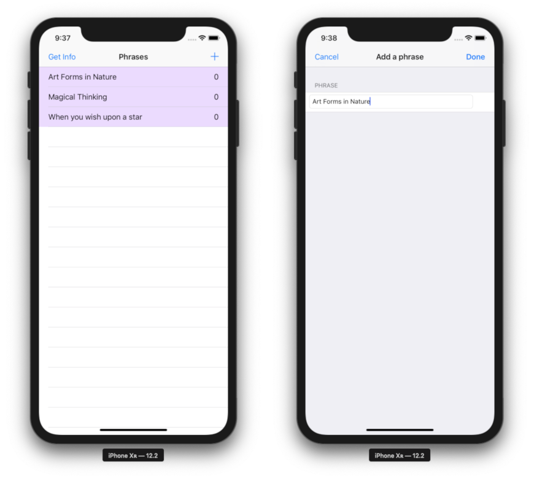

# WordsAndPhrases
### Demonstrates the use of a Rest API, Core Data, Unit Tests and UI Tests
#### The app and tests are written in Swift  

This app is designed to read word definitions from a Rest API and store the word, its number of syllables, and its parts of speech in Core Data.  

At this stage the UI is very simple, providing only what's needed to develop automated tests of the underlying Rest API and Core Data.

The first screen displays a list of phrases, while the second screen provides a means of adding phrases to the list.  
When a new phrase is entered, the words of that phrase are individually passed to the API which returns the number of syllables and parts of speech for the particular word.

The phrase, its words and their syllables and parts of speech are then stored in Core Data.  
If the phrase or its words are already stored, then they're ignored so the API is not called and there are no duplicates.  

A phrase can be deleted from the list on the first screen, but its words and their info remains.

In order to run this code, the API requires an authentication key.  
Since this is my personal key, and I can be charged for the use of this API, I've removed the key from the code.  
I will provide the key for anyone who is interested in running the app or its tests. - **Jerry Barnes**

